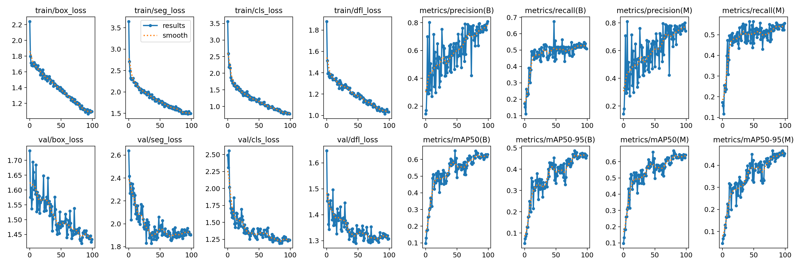
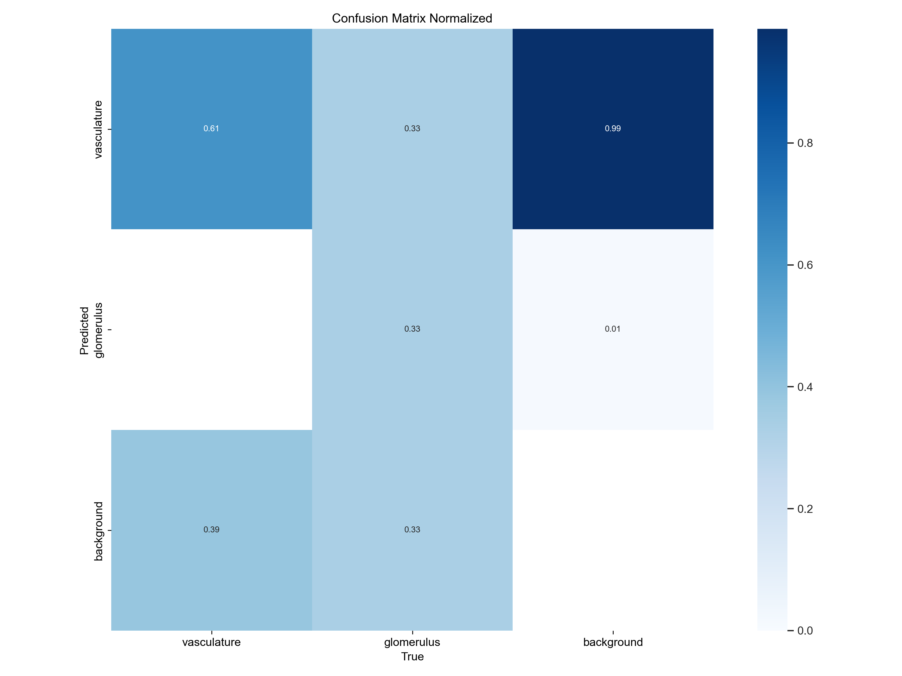

# Identifying blood vessels in kidney histology slides

## Problem statement
Microvasculature is known to be critical in understanding the health and function of the human body. Currently microvasculature (blood vessels) is not well mapped in all regions of the body so identifying the layout of vasculature throughout the human body could help predict functional aspects of health.

This project is designed using the kaggle competition [HubMAP - Hacking the Human Vasculature](https://www.kaggle.com/competitions/hubmap-hacking-the-human-vasculature).

### Background
The kidney is a critical organ utilized in the elimination of waste product from the body. There are three major components of the kidney: the outer cortex, medulla, and the hilum.

The cortex of the kidney contain many small structures which can be confused for microvasculature such as glomerulus and collecting ducts.

### Goal
Given a 2D histology slide identify segments of the image that contain blood vessels and segments of the image containing glomerulus.

### Datasets

This data set is from the [HubMAP - Hacking the Human Vasculature](https://www.kaggle.com/competitions/hubmap-hacking-the-human-vasculature) competition on Kaggle. All data sets were taken from this competition. 

Taken from the competition

>The competition data comprises tiles extracted from five Whole Slide Images (WSI) split into two datasets. Tiles from Dataset 1 have annotations that have been expert reviewed. Dataset 2 comprises the remaining tiles from these same WSIs and contain sparse annotations that have not been expert reviewed.

>All of the test set tiles are from Dataset 1.
Two of the WSIs make up the training set, two WSIs make up the public test set, and one WSI makes up the private test set.
The training data includes Dataset 2 tiles from the public test WSI, but not from the private test WSI.

>We also include, as Dataset 3, tiles extracted from an additional nine WSIs. These tiles have not been annotated. You may wish to apply semi- or self-supervised learning techniques on this data to support your predictions.

### Utilize Yolov8
Yolov8 is a CNN model with a specific model designed towards segmentation.

#### Initial Training Results

Since the number of glomerulus features was quite low (n=36) results are not smooth. We reach 48.667% for highest box mAP score and the segmentation mask mAP reaches 46.594%.